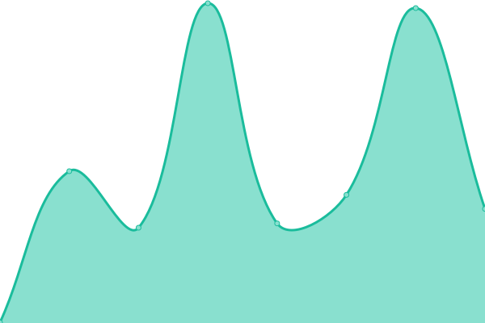
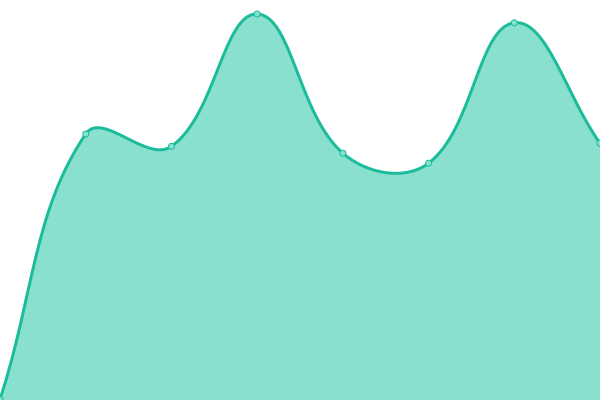
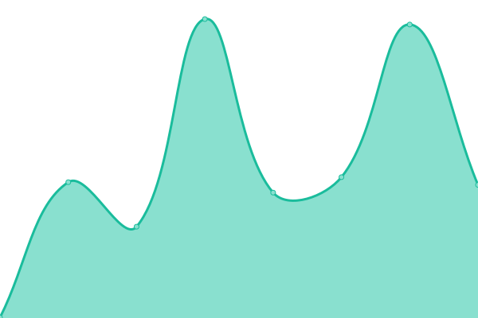

# [📈 Live Status](https://con.github.io/upptime): <!--live status--> **🟩 All systems operational**

This repository contains the open-source uptime monitor and status page for [Center for Open Neuroscience](http://centerforopenneuroscience.org), powered by [Upptime](https://github.com/upptime/upptime).

With [Upptime](https://upptime.js.org), you can get your own unlimited and free uptime monitor and status page, powered entirely by a GitHub repository. We use [Issues](https://github.com/con/upptime/issues) as incident reports, [Actions](https://github.com/con/upptime/actions) as uptime monitors, and [Pages](https://con.github.io/upptime) for the status page.

<!--start: status pages-->
<!-- This summary is generated by Upptime (https://github.com/upptime/upptime) -->
<!-- Do not edit this manually, your changes will be overwritten -->
<!-- prettier-ignore -->
| URL | Status | History | Response Time | Uptime |
| --- | ------ | ------- | ------------- | ------ |
|  [centerforopenneuroscience.org](https://centerforopenneuroscience.org/) | 🟩 Up | [centerforopenneuroscience-org.yml](https://github.com/con/upptime/commits/HEAD/history/centerforopenneuroscience-org.yml) | 

 317ms
     
 | 

<a href="https://con.github.io/upptime/history/centerforopenneuroscience-org">80.18%</a>
    

|  [datalad.org](https://datalad.org/) | 🟩 Up | [datalad-org.yml](https://github.com/con/upptime/commits/HEAD/history/datalad-org.yml) | 

 816ms
     
 | 

<a href="https://con.github.io/upptime/history/datalad-org">100.00%</a>
    

|  [datasets.datalad.org](https://datasets.datalad.org/) | 🟩 Up | [datasets-datalad-org.yml](https://github.com/con/upptime/commits/HEAD/history/datasets-datalad-org.yml) | 

 236ms
     
 | 

<a href="https://con.github.io/upptime/history/datasets-datalad-org">80.20%</a>
    

|  [registry.datalad.org](http://registry.datalad.org/) | 🟩 Up | [registry-datalad-org.yml](https://github.com/con/upptime/commits/HEAD/history/registry-datalad-org.yml) | 

 742ms
     
 | 

<a href="https://con.github.io/upptime/history/registry-datalad-org">80.22%</a>
    

|  [store.datalad.org](https://store.datalad.org/) | 🟩 Up | [store-datalad-org.yml](https://github.com/con/upptime/commits/HEAD/history/store-datalad-org.yml) | 

 268ms
     
 | 

<a href="https://con.github.io/upptime/history/store-datalad-org">80.23%</a>
    

|  [dandiarchive.org](https://dandiarchive.org/) | 🟩 Up | [dandiarchive-org.yml](https://github.com/con/upptime/commits/HEAD/history/dandiarchive-org.yml) | 

 250ms
     
 | 

<a href="https://con.github.io/upptime/history/dandiarchive-org">99.78%</a>
    

|  [hub.dandiarchive.org](https://hub.dandiarchive.org) | 🟩 Up | [hub-dandiarchive-org.yml](https://github.com/con/upptime/commits/HEAD/history/hub-dandiarchive-org.yml) | 

 672ms
     
 | 

<a href="https://con.github.io/upptime/history/hub-dandiarchive-org">95.75%</a>
    

|  [neuro.debian.net](https://neuro.debian.net/) | 🟩 Up | [neuro-debian-net.yml](https://github.com/con/upptime/commits/HEAD/history/neuro-debian-net.yml) | 

 244ms
     
 | 

<a href="https://con.github.io/upptime/history/neuro-debian-net">80.24%</a>
    

|  [pymvpa.org](http://pymvpa.org/) | 🟩 Up | [pymvpa-org.yml](https://github.com/con/upptime/commits/HEAD/history/pymvpa-org.yml) | 

 600ms
     
 | 

<a href="https://con.github.io/upptime/history/pymvpa-org">80.26%</a>
    

|  [singularity-hub.org archive API](http://singularity-hub.org/api/) | 🟩 Up | [singularity-hub-org-archive-api.yml](https://github.com/con/upptime/commits/HEAD/history/singularity-hub-org-archive-api.yml) | 

 436ms
     
 | 

<a href="https://con.github.io/upptime/history/singularity-hub-org-archive-api">80.27%</a>
    

<!--end: status pages-->

[**Visit our status website →**](https://con.github.io/upptime)

## 📄 License

- Powered by: [Upptime](https://github.com/upptime/upptime)
- Code: [MIT](./LICENSE) © [Center for Open Neuroscience](http://centerforopenneuroscience.org)
- Data in the `./history` directory: [Open Database License](https://opendatacommons.org/licenses/odbl/1-0/)
